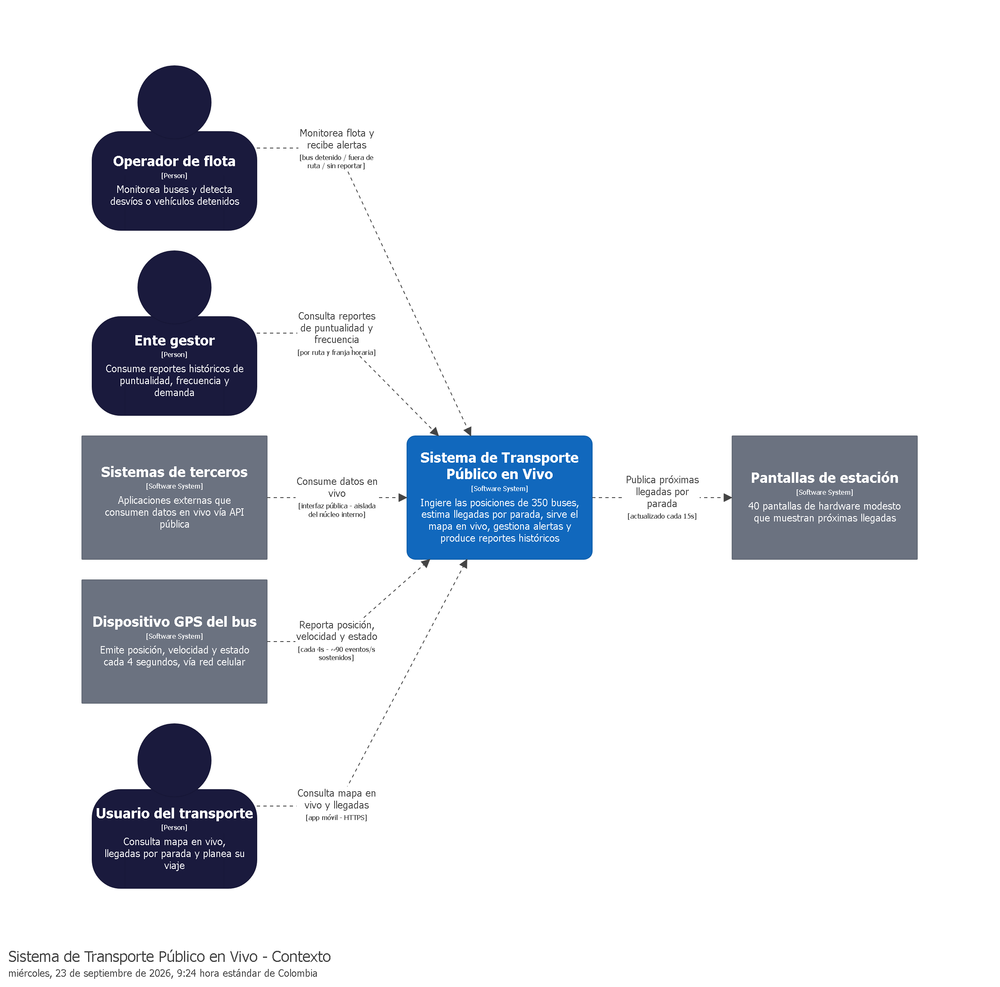

# ENTREGA 1 - Cuestionario 1
**Programa de Ingeniería de Sistemas**
**Arquitectura de software**
**Daniel Andres Esteban Carrillo**
**2026**

**Integrantes:**
* Juan Diego Contreras Garcia
* Yefferson Delgado
* Juan Quintero
* Javier Ramirez
* Luis Soto
* Yarley Guillen

---

## Pregunta 1: Actores y sus Intercambios
Listar los actores del sistema del caso (personas y sistemas externos) y, para cada uno, qué información intercambia con el sistema: qué le entrega y qué recibe. Un actor sin intercambio de información no es un actor del sistema.

**Los actores identificados que interactúan directa o indirectamente con el sistema son:**

*   **Usuario del transporte:** Consulta el mapa en vivo, verifica las estimaciones de llegada por parada y planea tu viaje.
*   **Dispositivo GPS del bus:** Emite datos de posición, velocidad y estado cada 4 segundos a través de redes celulares.
*   **Operador de flota:** Monitorea los buses en tiempo real, detecta desvíos de ruta y gestiona alertas de vehículos detenidos.
*   **Ente gestor:** Consume reportes históricos detallados sobre puntualidad, frecuencias reales y demanda para la toma de decisiones y rediseño de rutas.
*   **Pantallas de estación:** Dispositivos de hardware que muestran las próximas llegadas por parada, diseñados para operar continuamente.
*   **Sistemas de terceros:** Desarrolladores o aplicaciones externas que consumen la interfaz (API) pública para construir servicios sobre los datos en vivo.

---

## Pregunta 2: Funciones Esenciales
Enumerar las cinco a siete funciones sin las cuales el sistema no existe, con una línea por función: qué hace y para quién. No es la lista completa de requisitos del caso, es la esencia. Si al quitar una función el sistema sigue teniendo sentido, no era esencial.

**Funciones Esenciales (Requisitos Funcionales):**

*   **Ingestión continua:** Recepción sostenida de posiciones de toda la flota (90 eventos/segundo) sin acumular retrasos en el procesamiento.
*   **Visualización en mapa:** Provisión de datos en vivo para graficar la posición de los buses de una ruta específica.
*   **Estimación de llegadas:** Cálculo y actualización de estimaciones de llegada por parada, refrescadas al menos cada 15 segundos para las apps y pantallas.
*   **Gestión de alertas operativas:** Detección automática y notificación de eventos anómalos (bus detenido, fuera de ruta o sin reportar).
*   **Almacenamiento histórico:** Guardado persistente de recorridos para análisis posterior (independiente del flujo de tiempo real).
*   **Generación de reportes:** Creación de informes de puntualidad y frecuencia por ruta y franja horaria.
*   **Exposición de datos (API Pública):** Provisión de una interfaz segura para que terceros puedan aprovechar el flujo de datos en vivo sin saturar la infraestructura central.

---

## Pregunta 3: Diagrama de Contexto

---

## Pregunta 4: Primer Escenario de Calidad - La Tensión Principal
Tomar la primera "demanda de calidad conocida" del caso y convertirla en un escenario completo de seis partes: fuente, estímulo, artefacto, entorno, respuesta y medida. La medida debe ser un número verificable (sin medida no hay escenario).

**Escenario 1: Ingestión sostenida, no por picos (Rendimiento)**

| Parte | Descripción |
| :--- | :--- |
| **Fuente** | Dispositivo GPS del bus. |
| **Estímulo** | Envío de posiciones a una tasa de 90 eventos por segundo de forma sostenida durante 16 horas. |
| **Artefacto** | Componente de ingesta del sistema (Gateway / Broker). |
| **Entorno** | Operación normal diurna. |
| **Respuesta** | El flujo de escritura recibe los eventos aislándolos de las consultas de lectura. |
| **Medida** | No se acumula retraso en el procesamiento de la ingesta (cero degradación temporal sostenida). |

---

## Pregunta 5: Segundo Escenario de Calidad - Otro Atributo
Redactar un segundo escenario completo sobre un atributo de calidad distinto al anterior (otra de las demandas del caso, o una tensión que el grupo identifique). Mismas seis partes, misma exigencia con la medida.

**Escenario 2: Un dato, miles de lectores (Escalabilidad / Costo)**

| Parte | Descripción |
| :--- | :--- |
| **Fuente** | Usuario del transporte (App) y Pantallas de estación. |
| **Estímulo** | Miles de consultas simultáneas para conocer la estimación de llegada de los buses. |
| **Artefacto** | Módulo de distribución de datos en vivo (Caché / Fan-out). |
| **Entorno** | Operación bajo alta concurrencia. |
| **Respuesta** | El sistema distribuye el dato procesado desde memoria caché, evitando consultar la base de datos subyacente para cada petición. |
| **Medida** | Las actualizaciones llegan cada 15 segundos a los clientes sin multiplicar linealmente el costo de lectura en la nube. |

---

## Pregunta 6: ¿Monolito o Distribuido?
Para la primera versión del sistema: ¿un monolito o servicios separados? Justificar con las tensiones del caso (no con preferencias) y declarar explícitamente qué sacrifica la opción elegida. Una decisión sin trade-off declarado no es una decisión.

**Justificación por tensiones:** Las tensiones exigen aislar la "Ingestión sostenida" de "Un dato, miles de lectores". Un monolito acopla los recursos de I/O; un pico masivo de usuarios abriendo la app saturaría la base de datos, atrasando la recepción de posiciones del GPS. Separar un bus de eventos con consumidores independientes permite que el histórico y el tiempo real escalen asimétricamente.

**Trade-off sacrificado:** Se sacrifica la consistencia fuerte y la simplicidad operativa. El equipo asume la complejidad de mantener consistencia eventual (el mapa puede mostrar un dato de hace 2 segundos) y el sobrecosto de administrar la infraestructura de un broker de mensajería (Kafka/Kinesis).

---

## Pregunta 7: Lo Síncrono y lo Asíncrono del Caso
Identificar en el caso una operación que debe ser síncrona (quien la pide necesita el resultado en esa misma respuesta) y una que debería procesarse por una cola de mensajes. Justificar ambas y describir qué ocurre en cada una si el otro extremo está caído en ese momento.

*   **Asíncrona (Ingesta de posiciones):** Cuando el GPS envía sus coordenadas, debe ir a una cola. El bus no necesita devolver el cálculo de llegada, solo un ACK (recibido).
    *   *Si el consumidor falla:* Los datos no se pierden; quedan guardados en el broker de mensajería y se procesan cuando el servicio histórico/tiempo real vuelva a levantar.
*   **Síncrona (Consulta de estimación en app):** Cuando el usuario abre la app y consulta cuánto falta. Requiere la respuesta en el mismo ciclo HTTP-Request.
    *   *Si el servicio falla:* La app recibe un error HTTP 503 (Servicio no disponible) tras un timeout; no tiene sentido encolar esta petición porque un dato de estimación entregado 5 minutos tarde carece de valor.

---

## Pregunta 8: Borrador del ADR-000

**ADR-000: Arquitectura orientada a eventos para la ingesta de GPS, con caminos separados para tiempo real e histórico**
**Estado:** Propuesto

### Contexto
El sistema debe recibir la posición de 350 buses cada 4 segundos, es decir, un flujo sostenido de 90 eventos/segundo durante 16 horas diarias, no un pico ocasional. Sobre ese mismo flujo conviven consumidores muy distintos:
*   La app del usuario y las 40 pantallas de estación, que necesitan la posición más reciente de cada bus con baja latencia (RF-02, RF-03, RF-04).
*   El operador de flota, que necesita detectar desvíos, buses detenidos o sin reportar (RF-05).
*   El ente gestor, que necesita el histórico completo y sin huecos para calcular puntualidad y frecuencia por ruta y franja horaria (RF-06, RF-07).
*   Terceros externos, que consumen una interfaz pública sobre los datos en vivo (RF-08) y que no pueden competir por los mismos recursos que el sistema interno.

Estos consumidores tienen contratos distintos sobre el mismo dato: el camino en vivo tolera perder un evento suelto pero no retrasarse, mientras que el camino histórico tolera llegar tarde pero no puede tener huecos grandes. Además, un mismo dato (la posición de un bus) es leído por miles de clientes, así que multiplicar lectores no puede multiplicar el costo de consultar la base de datos (fan-out). Finalmente, los GPS reportan por red celular, con zonas de sombra y eventos que llegan desordenados o atrasados hasta 3 minutos.

En consecuencia, el sistema no puede resolverse como una aplicación transaccional típica (escribir y leer contra la misma base de datos): la escritura sostenida, la lectura masiva y la persistencia histórica tienen presiones distintas y, si comparten el mismo camino, cualquier pico de lectores atrasaría la ingesta y degradará la app "para siempre", no solo por un instante.

Esta decisión define el esqueleto por donde entra y se reparte todo el flujo GPS, y de ella dependen directamente las tres demandas de calidad conocidas del caso (ingestión sostenida, fan-out barato, dos velocidades de la verdad).

### Decisión
Se adopta una arquitectura orientada a eventos: cada posición GPS se publica en un flujo (log) central de eventos, del cual se derivan de forma independiente un camino de tiempo real (que mantiene el último estado conocido de cada bus y lo distribuye por publicación/suscripción hacia el mapa en vivo, las pantallas de estación y las alertas del operador) y un camino histórico (que persiste cada evento, sin descartar, en un almacenamiento orientado a analítica para los reportes del ente gestor), dejando la interfaz pública para terceros como un consumidor adicional, aislado y con límites de consumo propios, que nunca lee directamente del núcleo interno.

### Alternativas consideradas
1.  **Base de datos relacional única, con lectura directa por parte de todos los clientes.** Es la opción más simple de implementar y la que el equipo domina mejor de entrada, pero mezcla en una sola pieza la escritura sostenida (90 eventos/s) con miles de lecturas concurrentes: cualquier pico de la app o de las pantallas compite por el mismo recurso que la ingesta, justo lo que el caso pide evitar. Se descarta porque no aísla el flujo de escritura de las consultas.
2.  **Réplicas de lectura sobre la misma base transaccional (primaria + réplicas).** Alivia parte de la presión de lectura sin rediseñar el flujo de escritura, y es un paso intermedio razonable si el presupuesto no permitiera un bus de eventos. Sin embargo, cada réplica sigue siendo una copia completa de la base de datos, así que el costo de fan-out crece casi linealmente con el número de lectores (miles de usuarios), y no resuelve la diferencia de contrato entre tiempo real e histórico: ambos seguirán siendo la misma tabla con la misma semántica. Se descarta porque no ataca la causa del problema, solo amortigua el síntoma.
3.  **Difusión en memoria sin log persistente (pub/sub efímero tipo WebSocket broadcast).** Resuelve muy bien el fan-out para el mapa en vivo y sería más barato de operar que un log de eventos. El problema es que, sin un buffer persistente, un consumidor lento o caído (por ejemplo, una pantalla de estación que perdió conexión, tal como contemplan las restricciones) pierde eventos para siempre, y no queda ningún rastro para reconstruir el histórico ni para corregir eventos que llegan desordenados. Se descarta porque no da una fuente confiable para el camino histórico ni tolera el desorden de red celular mencionado en las restricciones.

### Consecuencias
**Mejora:**
*   La ingesta queda aislada de los lectores: un pico de usuarios en la app no puede atrasar la escritura de posiciones, que es la demanda de calidad más crítica del caso.
*   El fan-out deja de ser "una consulta por usuario": todos los consumidores en vivo leen del mismo último estado publicado, no de la base de datos, lo que acota el costo aunque crezcan los usuarios.
*   El camino histórico puede reconstruirse o reprocesarse a partir del log si se detecta un error de cálculo, y puede tolerar caídas temporales sin perder datos, porque el evento queda guardado y se consume cuando el consumidor se recupera.
*   Los dos consumidores (tiempo real e histórico) pueden evolucionar y escalar por separado, lo cual facilita absorber cambios futuros (por ejemplo, un componente de IA que consuma el mismo flujo) sin tocar el resto del sistema.
*   La interfaz pública para terceros se conecta como un consumidor más del flujo, no contra el núcleo, así que un abuso de esa interfaz no puede tumbar el sistema interno (restricción explícita del caso).

**Empeora / trade-off que se acepta:**
*   Se introduce una pieza operativa nueva (el bus/log de eventos) que el equipo debe aprender a operar, monitorear y dimensionar, con su propio costo dentro del presupuesto topado por contrato.
*   El camino de tiempo real pasa a ser eventualmente consistente: lo que ve el usuario es "el último estado publicado", no una lectura directa y sincrónica del bus, lo que exige definir y comunicar una ventana de frescura aceptable (ligado a RF-03: actualización cada 15 segundos).
*   Hay que decidir explícitamente cómo se tratan los eventos atrasados o desordenados (corregir, marcar o descartar), decisión que esta ADR no cierra y que debe documentarse en un ADR posterior.
*   Hay más piezas para depurar ante un incidente (productor, log, y al menos dos consumidores) en lugar de una sola base de datos, lo que aumenta la complejidad operativa a cambio del aislamiento ganado.

